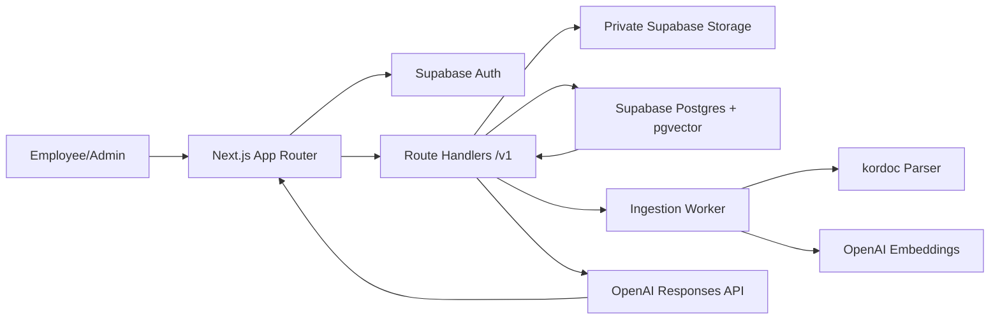

<p align="center">
  
</p>

<h1 align="center">Manualmind</h1>

<p align="center">
  회사 매뉴얼을 업로드하면 직원 질문에 근거와 함께 답하는 사내 온보딩 RAG 워크스페이스
</p>

<p align="center">
  
  
  
  
</p>

## Overview

Manualmind는 회사별 워크스페이스에 업로드된 매뉴얼을 분석하고, 직원이 자연어로 질문하면 관련 문서 근거를 먼저 검색한 뒤 출처가 포함된 답변을 제공합니다. 관리자에게는 문서 업로드, 버전 교체, 질문 통계, 직원 문의 관리 화면을 함께 제공합니다.

### What It Does

| 영역 | 기능 |
| --- | --- |
| 직원 경험 | AI 질문, 매뉴얼 열람, 답변 근거 확인, 부족한 답변 요청 |
| 관리자 경험 | 문서 업로드, 문서 상태/버전 관리, 대화 이력, 질문 분석, 구성원 관리 |
| RAG 파이프라인 | `kordoc` 파싱, 구조 보존 청킹, OpenAI 임베딩, pgvector + FTS 검색 |
| 보안/운영 | Supabase Auth, workspace 권한 검사, private Storage, signed upload URL, 감사 로그 |

## Architecture



## Tech Stack

| Layer | Stack |
| --- | --- |
| App | Next.js 15, React 19, TypeScript |
| UI | App Router, CSS, lucide-react |
| Auth/Data | Supabase Auth, Postgres, Storage, RLS |
| Search | pgvector HNSW, PostgreSQL full-text search, RRF, MMR |
| AI | OpenAI embeddings and response generation |
| Parsing | `kordoc`, `pdfjs-dist` |
| Quality | ESLint, TypeScript, Vitest, GitHub Actions |

## Quick Start

### Prerequisites

- Node.js 20+
- Supabase project
- OpenAI API key

### Install

```powershell
npm.cmd ci
Copy-Item .env.example .env.local
```

`.env.local`에 실제 값을 입력합니다. 비밀값은 Git에 커밋하지 않습니다.

```dotenv
NEXT_PUBLIC_SUPABASE_URL=
NEXT_PUBLIC_SUPABASE_PUBLISHABLE_KEY=
SUPABASE_SERVICE_ROLE_KEY=
OPENAI_API_KEY=
OPENAI_RESPONSE_MODEL=gpt-5.6-luna
CRON_SECRET=
```

### Database

Supabase CLI를 연결한 뒤 migration을 적용합니다.

```powershell
npx.cmd supabase login
npx.cmd supabase link --project-ref YOUR_PROJECT_REF
npx.cmd supabase db push
```

### Run Locally

```powershell
npm.cmd run dev
```

문서 분석 워커를 별도 터미널에서 실행합니다.

```powershell
npm.cmd run worker
```

## Scripts

| Command | Description |
| --- | --- |
| `npm.cmd run dev` | 로컬 개발 서버 실행 |
| `npm.cmd run build` | 프로덕션 빌드 |
| `npm.cmd run start` | 빌드 결과 실행 |
| `npm.cmd run lint` | ESLint 검사 |
| `npm.cmd run typecheck` | TypeScript 검사 |
| `npm.cmd test` | Vitest 테스트 |
| `npm.cmd run worker` | ingestion worker 실행 |

## Project Structure

```text
app/                    Next.js routes, product pages, API routes
components/             Chat, admin, app shell UI
lib/rag/                Chunking, retrieval, ranking, prompt, ingestion logic
lib/server/             Server-side API helpers
lib/supabase/           Supabase browser/server/admin clients
scripts/                Long-running ingestion worker
supabase/migrations/    Database schema, RLS, RPC, storage setup
docs/                   Architecture, API contract, deployment notes
```

## Documentation

- [API contract](docs/api-contract.md)
- [RAG architecture](docs/rag-architecture.md)
- [Deployment guide](docs/deployment-guide.md)
- [Frontend integration guide](docs/frontend-integration.md)
- [Team Git workflow](docs/team-git-workflow.md)

## Deployment Notes

Vercel 배포를 기준으로 함수 제한 시간과 API 캐시 정책은 `vercel.json`에 정의되어 있습니다. `GET /api/internal/ingestion/run`은 `Authorization: Bearer $CRON_SECRET`가 필요하며, Vercel Cron 또는 별도 장기 실행 워커 중 하나로 운영할 수 있습니다.

배포 전 기본 확인:

```powershell
npm.cmd run lint
npm.cmd run typecheck
npm.cmd test
npm.cmd run build
```

## Security Notes

- Supabase `service_role` 키와 OpenAI 키는 서버/워커에서만 사용합니다.
- 원본 문서는 public bucket이 아니라 private Storage에 저장합니다.
- 브라우저 업로드는 서버가 발급한 signed upload URL만 사용합니다.
- 모든 workspace 데이터 접근은 서버에서 멤버십과 역할을 다시 검사합니다.
- 모델 답변은 검색된 문서 근거를 기준으로 생성하고, 인용 정보를 함께 반환합니다.
